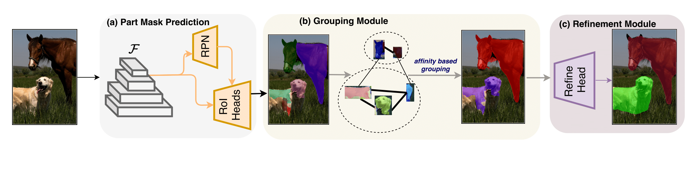

# UDOS: Open-world Instance Segmentation with Bottom-up Supervision

[[project page](https://tarun005.github.io/UDOS/)] [[paper](https://arxiv.org/pdf/)]

UDOS (**U**p-**D**own **O**pen-world **S**egmentation) is a simple and efficient method for open-world instance segmentation to detect and segment novel objects unseen during training. We leverage bottom-up supervision from unsupervised proposal generation method such as selective search and guide it to learn top-down networks such as MaskRCNN to segment open-world objects not annotated during training. UDOS first predicts part-mask associated with both seen and unseen objects, which is followed by lightweight grouping and refinement modules to predict instance level masks. 

## Overview of UDOS

<center></center>

## Results

### Cross-category setting (VOC -> NonVOC)

| Model      | AR100-Box | AR100-Mask |
| ----------- | ----------- | -------  | 
| LDET       | 30.9     | 26.7      |
| OLN        | 32.5      | 26.9       |
| GGN        | 31.6      | 28.7       |
| UDOS [Ours]| **33.5**      | **31.6**       |

More results are provided in our [[project page](https://tarun005.github.io/UDOS/)].

## Testing Pre-trained models

#### Cross Category Setting: VOC to NonVOC 

Download the pre-trained model from [[here](https://drive.google.com/file/d/1qT5OrftlbWN0Zidq3R82L6-dV3CUi1TM/view?usp=sharing)]. 

Then run the inference as follows.

```
sh jobs/UDOS_test_VOC.sh
```

#### Cross Dataset Setting: COCO to UVO

Firstly, download the UVO dataset from [[here](https://sites.google.com/view/unidentified-video-object/dataset?pli=1)]. Then, download the pre-trained model trained on complete COCO dataset from [[here](https://drive.google.com/file/d/1_NKAi1jTzYJQ11G1wzKuZUITMVHheled/view?usp=sharing)]. 

After downloading the pre-trained models, you can run inference using the following script.

```
sh jobs/UDOS_test_COCO.sh
```

## Training UDOS

## Generating super-pixel segmentation.

You can download the super-pixel segmentation from [[here](https://drive.google.com/file/d/125Wq4Kqw0Ev2pQFq3ZhiKMnMENBURJoX/view?usp=sharing)]. Alternatively, you can generate your own superpixel segmentation usng selective search as follows.

```
python -m torch.distributed.launch --nproc_per_node=8 --use_env genSS.py --split train --output_file instances_train2017_SS.json
```

With the generated/downloaded superpixels, you can use the scripts inside the `jobs/` folder to train the UDOS models. For example, to train the cross-category model, you can use

```
sh jobs/UDOS_train_VOC.sh
```

Cross-dataset can also be trained similarly, using `UDOS_train_COCO.sh`. The training should take less than a day on 8 GPUs.

## Citation

You can cite our work as follows.
```
@article{kalluri2023udos
        author    = {Kalluri, Tarun and Wang, Weiyao and Wang, Heng and Chandraker, Manmohan and Torresani, Lorenzo and Tran, Du},
        title     = {Open-world Instance Segmentation: Top-down Learning with Bottom-up Supervision},
        journal   = {arxiv},
        year      = {2023},
      },
```

